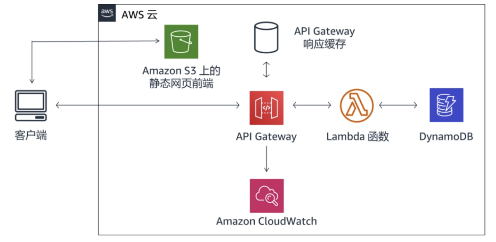
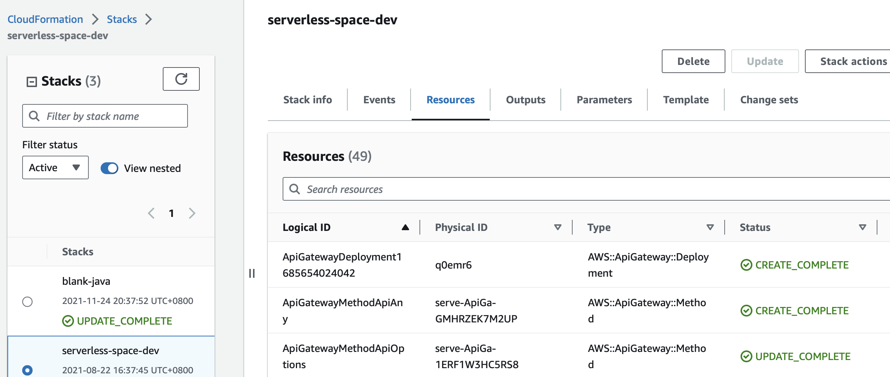
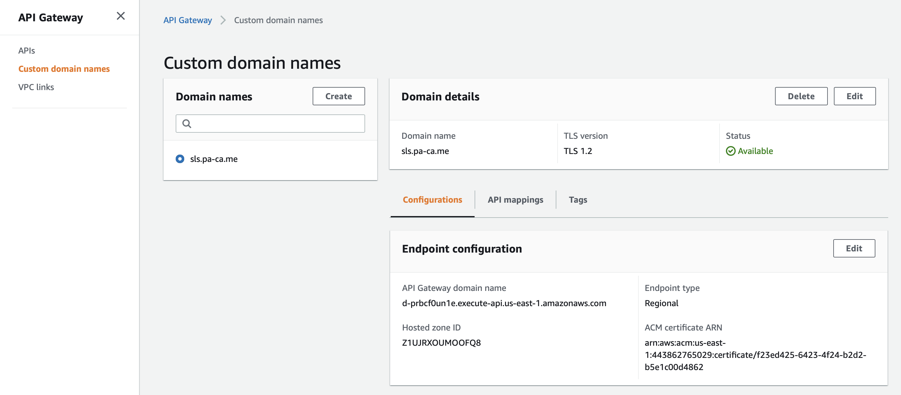
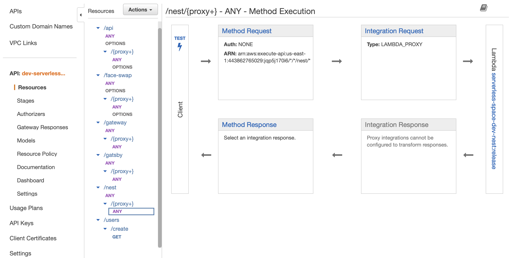
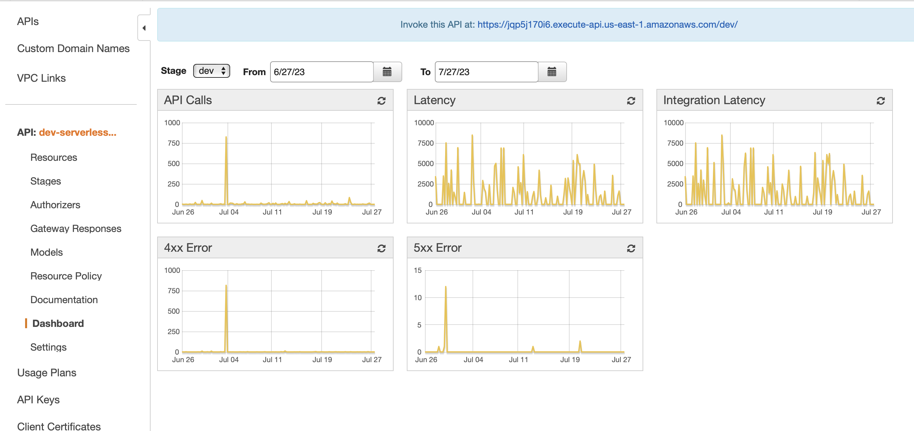

# serverless-space

---

> My General SFF (Serverless for front-end).

[](https://sonarcloud.io/summary/new_code?id=Jeff-Tian_serverless-space)
[](https://sonarcloud.io/summary/new_code?id=Jeff-Tian_serverless-space)


## Online GraphQL Studio

- With CDN: https://sls.pa-ca.me/nest/graphql
- Without CDN: 
  - dev: https://jqp5j170i6.execute-api.us-east-1.amazonaws.com/dev/nest/graphql
  - stg: https://jqp5j170i6.execute-api.us-east-1.amazonaws.com/stg/nest/graphql
- Apollo Studio: https://studio.apollographql.com/graph/Serverless-Space/explorer?variant=current
  - Dashboard: https://studio.apollographql.com/public/Serverless-Space/variant/current

## Why

[一顿操作猛如虎，部署一个万能 BFF](https://zhuanlan.zhihu.com/p/412196725)

## Console

- url: https://console.aws.amazon.com/lambda/home?region=us-east-1#/functions
- login: jie.tian@live.cn

## Local development

```powershell
node_modules/.bin/serverless create -t aws-nodejs
node_modules/.bin/serverless config credentials --provider aws --key <key> --secret <secret>
node_modules/.bin/serverless deploy

curl https://jqp5j170i6.execute-api.us-east-1.amazonaws.com/dev/users/create
curl https://jqp5j170i6.execute-api.us-east-1.amazonaws.com/dev/api/
curl https://jqp5j170i6.execute-api.us-east-1.amazonaws.com/dev/nest/cats
curl https://jqp5j170i6.execute-api.us-east-1.amazonaws.com/dev/nest/graphql
```

### About adding new dependencies

Due to size limit of AWS Lambda, this project uses layers for node_modules. So when we need to add new dependencies to the project, besides the normal `yarn add xxx`, we need to also manually add the dependency to the [layers/nodejs/package.json](layers/nodejs/package.json).

## Run gatsby locally

```bash
yarn build && PORT=3000 node --experimental-modules dist/src/gatsby.js
```

## Run all offline

```shell
yarn offline

open http://localhost:3000/dev/gatsby/graphql?query=%23%20Welcome%20to%20GraphiQL%0A%23%0A%23%20GraphiQL%20is%20an%20in-browser%20tool%20for%20writing%2C%20validating%2C%20and%0A%23%20testing%20GraphQL%20queries.%0A%23%0A%23%20Type%20queries%20into%20this%20side%20of%20the%20screen%2C%20and%20you%20will%20see%20intelligent%0A%23%20typeaheads%20aware%20of%20the%20current%20GraphQL%20type%20schema%20and%20live%20syntax%20and%0A%23%20validation%20errors%20highlighted%20within%20the%20text.%0A%23%0A%23%20GraphQL%20queries%20typically%20start%20with%20a%20%22%7B%22%20character.%20Lines%20that%20start%0A%23%20with%20a%20%23%20are%20ignored.%0A%23%0A%23%20An%20example%20GraphQL%20query%20might%20look%20like%3A%0A%23%0A%23%20%20%20%20%20%7B%0A%23%20%20%20%20%20%20%20field(arg%3A%20%22value%22)%20%7B%0A%23%20%20%20%20%20%20%20%20%20subField%0A%23%20%20%20%20%20%20%20%7D%0A%23%20%20%20%20%20%7D%0A%23%0A%23%20Keyboard%20shortcuts%3A%0A%23%0A%23%20%20Prettify%20Query%3A%20%20Shift-Ctrl-P%20(or%20press%20the%20prettify%20button%20above)%0A%23%0A%23%20%20%20%20%20Merge%20Query%3A%20%20Shift-Ctrl-M%20(or%20press%20the%20merge%20button%20above)%0A%23%0A%23%20%20%20%20%20%20%20Run%20Query%3A%20%20Ctrl-Enter%20(or%20press%20the%20play%20button%20above)%0A%23%0A%23%20%20%20Auto%20Complete%3A%20%20Ctrl-Space%20(or%20just%20start%20typing)%0A%23%0A%0A%0A%7B%0A%20%20allNPMScript%20%7B%0A%20%20%20%20nodes%20%7B%0A%20%20%20%20%20%20name%0A%20%20%20%20%7D%0A%20%20%7D%0A%7D
```

## Deploy

### From local machine

Due to package size limitation, we have to run the following command to deploy: https://stackoverflow.com/a/69176517/769900

```shell
rm -rf node_modules && npm i --production
npm install -g serverless
npm install -g serverless-plugin-names

yarn pre-deploy
# check size of node_modules, if size > 250M, then need to clean some unnecessary dependencies to reduce the size
du -h -d 0 layers/nodejs/node_modules | sort -h
yarn deploy-from-local
```

### From GitHub Action

Every push will trigger auto deploy by GitHub action if tests pass.

- https://github.com/Jeff-Tian/serverless-space/actions

## Contributions

All kinds of contributions are welcome!

- [Submit issues]()
- [Submit pull requests]()
- [Documentation]()

## IDEs tips

### Webstorm

#### Shortcut keys

- Press `Ctrl+M` to jump to the matching brace.

## Star History

[](https://star-history.com/#jeff-tian/serverless-space&Date)

## 中文说明

这是我利用 AWS 免费资源构建一个 SFF 的实验场地，用于验证一些 Serverless 的想法。AWS 一共有 200 多个服务，目前这里使用的仅仅是一些 VPC 之外的服务。

### 架构图

客户端浏览器请求一个托管在 Amazon S3 或者其他静态托管服务上的静态网页，当网页中存在需要调用后端 API 的情况时，会通过 AWS API Gateway 对请求进行身份验证与授权，并调用 Lambda 函数与 DynamoDB 进行通信。通过 API Gateway 的缓存功能，可以有效减少 Lambda 函数的调用次数，从而减少后端负载，并在出现服务重复性请求时减少延迟。



API Gateway 还将日志发送给 Amazon CloudWatch。API Gateway 可以针对 API 中的每个阶段或针对每个方法向 CloudWatch 发送日志。日志记录的详细程度（错误或信息），以及是否应记录完整的请求和响应数据都可以进行配置。

API Gateway 可以发送到 CloudWatch 的详细指标如下：

- API 调用的数量
- 延迟
- 集成延迟
- HTTP 400 或者 500 错误

还可以激活访问日志记录，以记录谁访问过 API，以及是如何访问的。

### Cloud Formation

使用 [serverless.yml](./serverless.yml) 定义了一些资源，通过 serverless framework 生成了 Cloud Formation 模板，可以在 [AWS 控制台中](https://us-east-1.console.aws.amazon.com/cloudformation/home?region=us-east-1#/stacks/resources?filteringText=&filteringStatus=active&viewNested=true&stackId=arn%3Aaws%3Acloudformation%3Aus-east-1%3A443862765029%3Astack%2Fserverless-space-dev%2F39149940-0324-11ec-8c87-0aeefef9077b) 查看。



### 自定义域名

API Gateway 可以绑定[自定义域名](https://us-east-1.console.aws.amazon.com/apigateway/main/publish/domain-names?domain=sls.pa-ca.me&region=us-east-1)：



### API 映射

API Gateway 可以将[请求映射](https://us-east-1.console.aws.amazon.com/apigateway/home?region=us-east-1#/apis/jqp5j170i6/resources/fvzmag/methods/ANY)到 Lambda 函数，这样就可以通过 API Gateway 来调用 Lambda 函数。



### API Dashboard

API Gateway 可以生成一个[仪表盘](https://us-east-1.console.aws.amazon.com/apigateway/home?region=us-east-1#/apis/jqp5j170i6/dashboard)来展示 API 的调用情况。



## 💵 了解更多

欢迎来知乎[向我咨询](https://www.zhihu.com/consult/people/1073548674713423872)！

[](https://www.zhihu.com/consult/people/1073548674713423872)
